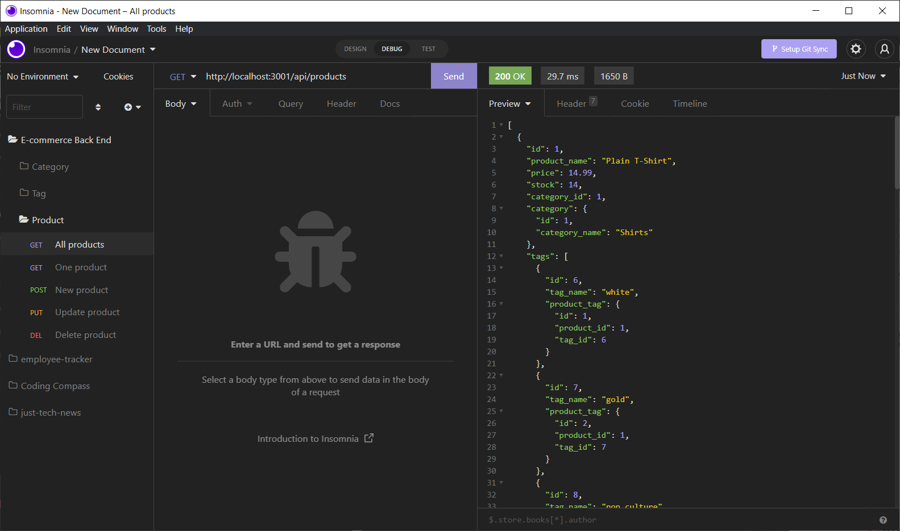

# E-commerce Back End

## Table of Contents

  - [Description](#description)
  - [Installation](#installation)
  - [Usage](#usage)
  - [Credits](#credits)
  - [Version History](#version-history)
  - [License](#license)

## Description

Internet retail, also known as e-commerce, is the largest sector of the electronics industry, having generated an estimated US$29 trillion in 2017 (Source: United Nations Conference on Trade and Development). E-commerce platforms like Shopify and WooCommerce provide a suite of services to businesses of all sizes. Due to the prevalence of these platforms, developers should understand the fundamental architecture of e-commerce sites.

Your challenge is to build the back end for an e-commerce site. You’ll take a working Express.js API and configure it to use Sequelize to interact with a MySQL database.

Because this application won’t be deployed, you’ll also need to create a walkthrough video that demonstrates its functionality and all of the following acceptance criteria being met. You’ll need to submit a link to the video and add it to the README of your project.

### User Story

```
AS A manager at an internet retail company
I WANT a back end for my e-commerce website that uses the latest technologies
SO THAT my company can compete with other e-commerce companies
```

### Acceptance Criteria

```
GIVEN a functional Express.js API
WHEN I add my database name, MySQL username, and MySQL password to an environment variable file
THEN I am able to connect to a database using Sequelize
WHEN I enter schema and seed commands
THEN a development database is created and is seeded with test data
WHEN I enter the command to invoke the application
THEN my server is started and the Sequelize models are synced to the MySQL database
WHEN I open API GET routes in Insomnia for categories, products, or tags
THEN the data for each of these routes is displayed in a formatted JSON
WHEN I test API POST, PUT, and DELETE routes in Insomnia
THEN I am able to successfully create, update, and delete data in my database
```

## Installation

1. Download the repository [here](https://github.com/mitchgeorge8/e-commerce-back-end).
2. Open a command prompt and cd to the root directory of this repository.
3. Using [Node.js](https://nodejs.org), run the command "npm install".
   - This will install the necessary Node packages.
4. In the root directory, create a file named ".env"
5. Open .env and enter the follwing information, using your MySQL username and password.
    ```
    DB_NAME='ecommerce_db'
    DB_USER='user'
    DB_PW='password'
    ```
6. Back in the terminal, enter "npm start".
7. In the browser, go to localhost:3001.
   - If you entered a different port in your .env file, navigate to that one.

## Usage

To use this application, start by following the steps listed above. Once you have navigated to the correct local port, you can perform GET, POST, PUT, and DELETE routes for categories, products, and tags. These routes constitute the necessary backend functionality of an e-commerce store.

[Walkthrough Video]()

Screenshot:



## Credits

1. [The Coding Bootcamp](https://github.com/coding-boot-camp)
2. [Mitchell George](https://github.com/mitchgeorge8)

## Version History

- 0.0 - [Starter code](https://github.com/coding-boot-camp/fantastic-umbrella)
- 1.0 - Initial release
  - See [commits](https://github.com/mitchgeorge8/e-commerce-back-end/commits)

## License

&copy; 2022 [Mitchell George](https://github.com/mitchgeorge8)

Permission is hereby granted, free of charge, to any person obtaining
a copy of this software and associated documentation files (the
"Software"), to deal in the Software without restriction, including
without limitation the rights to use, copy, modify, merge, publish,
distribute, sublicense, and/or sell copies of the Software, and to
permit persons to whom the Software is furnished to do so, subject to
the following conditions:

The above copyright notice and this permission notice shall be
included in all copies or substantial portions of the Software.

THE SOFTWARE IS PROVIDED "AS IS", WITHOUT WARRANTY OF ANY KIND,
EXPRESS OR IMPLIED, INCLUDING BUT NOT LIMITED TO THE WARRANTIES OF
MERCHANTABILITY, FITNESS FOR A PARTICULAR PURPOSE AND
NONINFRINGEMENT. IN NO EVENT SHALL THE AUTHORS OR COPYRIGHT HOLDERS BE
LIABLE FOR ANY CLAIM, DAMAGES OR OTHER LIABILITY, WHETHER IN AN ACTION
OF CONTRACT, TORT OR OTHERWISE, ARISING FROM, OUT OF OR IN CONNECTION
WITH THE SOFTWARE OR THE USE OR OTHER DEALINGS IN THE SOFTWARE.
